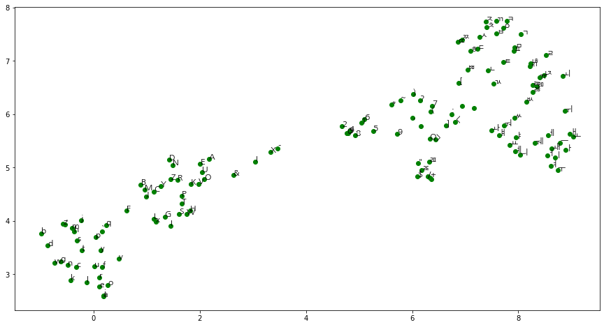

# Char2Vec

The char2vec algorithm is the same as Word2Vec but each character is considered as a word.

## Visualization



The below is the code used to draw the image above.

```py
import matplotlib.font_manager as fm
import matplotlib.pyplot as plt
import pandas as pd
import umap
from typewriter.usecases.char2vec import get_embeddings

font = fm.FontProperties(fname='data/fonts/NanumGothic-Regular.ttf', size=12)

embeddings = get_embeddings()
df = pd.DataFrame(embeddings.w_in, index=embeddings.characters.keys)
reducer = umap.UMAP(random_state=42).fit(df)
reduced = pd.DataFrame(reducer.transform(df), index=df.index)

fig, ax = plt.subplots(figsize=(15, 8))
ax.scatter(x=reduced[0], y=reduced[1], c='g')
for i, c in enumerate(reduced.index):
    ax.annotate(c, (reduced[0][i], reduced[1][i]), fontproperties=font)
plt.show()
```


